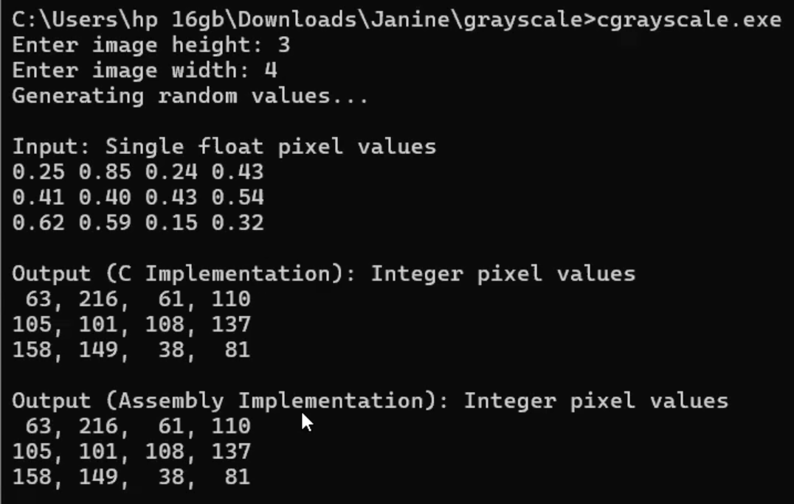
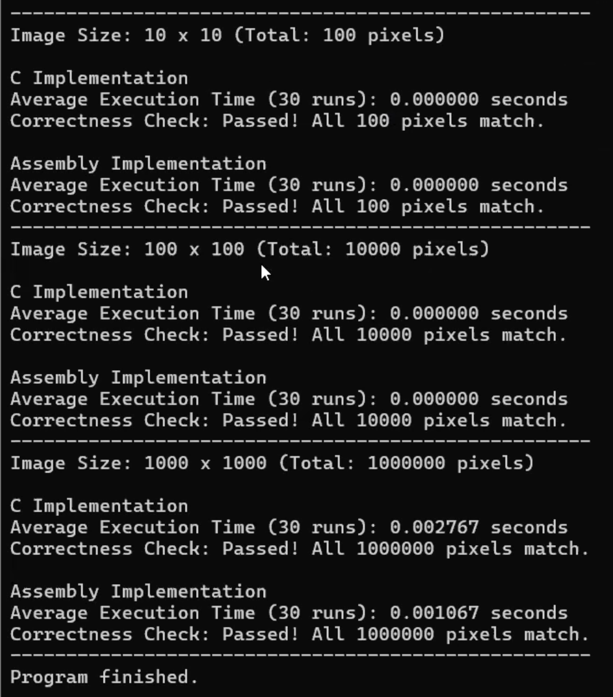

# x86-to-C Interface Programming Project
# Grayscale Image Conversion: Float to Uint8

## Project Overview
This project implements a program that maps from single precision float based grayscale to uint8 based integer representation.  

- **cgrayscale.c** handles: input collection, memory allocation, and output display.  
- **asmgrayscale.asm** handles: the actual conversion in **imgCvtGrayFloatToInt()** function.
- **rungrayscale.bat** handles: running and compilation of the program.

---

## 1. Execution Time 
We tested the conversion on three image sizes: **10×10, 100×100, 1000×1000 pixels**.  
Each test was run **30 times** to compute average execution times.

| Image Size | C Implementation (AVG sec) | ASM Implementation (AVG sec) |
|------------|----------------------------|-----------------------------|
| 10×10      | 0.000000                   | 0.000000                    |
| 100×100    | 0.000000                    | 0.000000                    |
| 1000×1000  | 0.002767                     | 0.001067                      |

--- 
## 2. Performance Analysis
In order to convert from the input single float pixels into the output int pixels using C, we used array indexing. In doing so, each element in the array takes up a fixed number of bytes where it is known during compile-time. This means that the address of the nth element in the array will be at an offset of n multiplied by the element_size number of bytes from the base address of the whole array (Parlante, 2008). Thus, array indexing may require the CPU to calculate the memory offset for every iteration. 

The C code also utilized type casting so that the output of the conversion will be converted as an unsigned char. However, Guijarro (2004) stated that numeric type conversions are usually computationally expensive. The C compiler may add extra instructions to casting from a 32-bit register to an 8-bit memory location. These 2 factors may have negatively impacted the average execution time using the C implementation, making it execute slower as compared to the Assembly implementation. 

---

## 3. Program Output with Correctness Check

---

## 4. Conclusion
The grayscale image conversion program is implemented using a C-to-x86 interface: C collects the input data and allocates memory, then calls the assembly function to perform the pixel calculations and conversion. The assembly function passes the results back to C, which displays the outputs and performs the correctness check. The timing results also show that the C implementation is slower than the assembly implementation, demonstrating the performance advantage of using SIMD instructions in assembly.

---

## 5. Video Link
Access to the video link of presentation: https://drive.google.com/file/d/1Tqf-fIoF4lrM3NCXCxfkUBJUGiGVjloG/view?usp=share_link

---

## 6. References
Guijarro, E. (2004, August 22). Type casting impact over execution performance in C#. Code Project. https://www.codeproject.com/articles/Type-casting-impact-over-execution-performance-in-#comments-section

Parlante, N., Zelenski, J. (2008, April 7). The Ins and Outs of C Arrays. Stanford University. https://see.stanford.edu/materials/icsppcs107/07-Arrays-The-Full-Story.pdf

---

## 7. Members
S19B Heisel Janine Lazaro

S19B Justine Erika Wee
